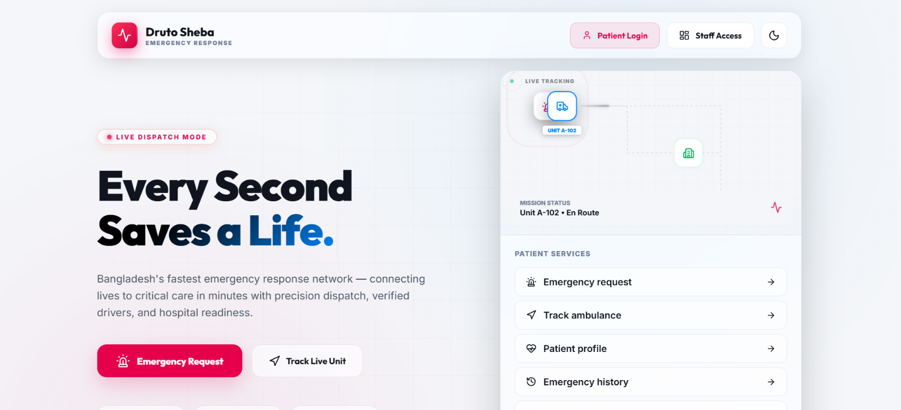

  

  # 🚑 Druto Sheba (দ্রুত সেবা)
  ### Next-Generation PostGIS Spatial Intelligence Emergency Response & Fleet Management Platform

  

    
  

  

    
    
    
    
    
  

---

## 🖥️ System Interface Overview

  
  
<i>Live Command Center, High-Precision Telemetry Radar & Dark Glassmorphism Design System</i>

---

## 🌟 Executive Overview
**Druto Sheba (দ্রুত সেবা)** is an enterprise-grade digital healthcare logistics and emergency fleet management ecosystem engineered for high-density metropolitan environments like Dhaka. Conventional emergency systems (like 999 or regional dispatchers) suffer from high bilateral call friction, zero hospital bed visibility, predatory surge pricing, and fatal dispatch latencies. 

Druto Sheba introduces an autonomous **Triangular Resource Matching Engine** linking the **Patient**, the **Nearest Available Ambulance**, and a **Bed-Available Hospital** using sub-second PostGIS ellipsoidal spatial geometry calculations (`ST_DistanceSphere`). The platform integrates live hardware GPS broadcasting (every 1.5s), turn-by-turn road polyline navigation via OSRM, a dynamic 4-tier commission settlement architecture, and multi-entity concurrency locking (`SELECT ... FOR UPDATE`).

---

## 🧭 Four Core Portals & Deep Capabilities

### 1. 🆘 Patient Portal (`/sos`, `/track`, `/appointments`, `/my-bills`, `/history`)
* **1-Tap Instant SOS:** Direct emergency trigger automatically parsing HTML5 Geolocation coordinates with condition categorization (*Cardiac Arrest*, *Severe Trauma*, *Burn Injury*, *Pediatric Crisis*, *Respiratory*).
* **Live Radar & Telemetry Tracker:** Visual Leaflet.js radar tracking the assigned ambulance's moving coordinates in real time with dynamic ETA calculation.
* **Specialist Doctor Directory & Appointment Booking:** Query specialist physicians categorized by medical department, hospital branch, and scheduled consultation days.
* **Autonomous 3-Hour Slot Expiry & Refund Engine:** Real-time billing settlement tracking with 3-hour payment timeout. Cancellations after payment trigger automatic ledger refund status (`Refunded`).
* **Triple-Tier Authentication:** Secure login via Bcrypt passwords, 1-Tap Biometric (WebAuthn / FIDO2 standard), or 4-digit Emergency PIN (strictly capped at 3 times per calendar month).

### 2. 🗺️ Driver Duty & Field App (`/duty`, `/bill-pay`, `/history`)
* **Pre-Shift Life Support Equipment Checklist:** Digital safety verification protocol requiring drivers to confirm Oxygen Cylinder Pressure (%), Defibrillator Battery Status, Suction Apparatus, and First-Aid Kit availability before switching to `On_Duty`.
* **Hardware GPS Broadcaster:** Continuous spatial telemetry emitter publishing latitude/longitude coordinates to the database backend every 1.5 seconds.
* **Turn-by-Turn Dynamic Routing:** Integrated Open Source Routing Machine (OSRM) mapping showing driving polyline routes from Driver Location ➔ Patient Pickup Point ➔ Destination Hospital.
* **In-Mission Telemetry Chat:** Bi-directional real-time messaging channel with the patient and central dispatcher with automated database audit logging.
* **Daily Earnings Ledger & Due Settlement:** Transparent financial console displaying daily cash fares collected, platform commission owed, and bKash/Rocket payment submission.

### 3. 📻 Dispatcher Command Center (`/dashboard`, `/fleet`, `/trips`)
* **City-Wide Emergency Live Radar:** Real-time geospatial overview displaying all active emergency calls, en-route vehicles, and hospital admission nodes.
* **Emergency Triage Queue:** Real-time triage monitor ranking inbound distress calls by medical severity level (`Critical`, `High`, `Medium`, `Low`).
* **Manual Override & Re-Routing:** Supervisory authority to manually re-route ambulances to alternate hospitals if the primary destination reports unexpected emergency room saturation.
* **Strict Browser Session Isolation:** Built-in tab-session security preventing unauthorized persistent access when shared hospital workstation terminals are refreshed or relaunched.

### 4. 📊 Admin Executive Board (`/control`, `/analytics`, `/doctors`, `/billing`, `/users`)
* **Live Hospital Capacity Telemetry:** Real-time monitor of Dhaka's premier medical centers, tracking available General Beds, ICU Beds, and emergency department status.
* **Dynamic Fare & Tiered Commission Pricing Engine:** Live dynamic pricing controls allowing administrative adjustments of Base Fare (৳750) and Per-KM rate (৳25) without touching database source code.
* **Staff Verification Barrier (9-Digit Security Key):** Tiered verification system requiring 9-digit cryptographic authorization keys for newly registered staff and drivers.
* **Mobile Payment Verification Pipeline:** Financial settlement interface to cross-verify bKash/Rocket TrxIDs and update platform ledgers in 1 click.
* **Automated Audit Logging:** Full visibility into system triggers, capturing driver shift updates, status transitions, and appointment actions.

---

## ⚡ Unique & Industry-First Innovations

1. **Dynamic Radius Expansion Engine (Adaptive Dispatch):**  
   If an emergency alert is not claimed by nearby units within 60 seconds, the search radius automatically expands from **500m** to **700m** (<120s), and finally to **1000m+** (<180s), ensuring zero unserviced emergency calls.
2. **Multi-Entity Atomic Concurrency Locking (`SELECT ... FOR UPDATE`):**  
   Pessimistic row-level locking serializes competing driver requests, guaranteeing zero double-assignments across high-load concurrent rescue claims.
3. **Dynamic 4-Tier Commission Model with Snapshot Isolation:**  
   Granular operational revenue tiers based on vehicle ownership and paramedic certification:
   * *Tier 1 (Company Fleet + Certified Paramedic):* 25% Platform Commission.
   * *Tier 2 (Company Fleet + Uncertified Driver):* 30% Platform Commission.
   * *Tier 3 (Driver-Owned + Certified Paramedic):* 3% Platform Maintenance Fee.
   * *Tier 4 (Driver-Owned + Uncertified Driver):* 5% Platform Maintenance Fee.
4. **Universal Tri-Directional Messaging Mesh (UTMM):**  
   Dedicated relational inbox partitions (`patient_inbox_messages`, `driver_inbox_messages`, `staff_inbox_messages`) ensuring reliable, unread-tracked delivery of critical clinical and financial alerts.
5. **Emergency PIN Quota Mechanism:**  
   Allows patients without passwords to log in via an encrypted 4-digit PIN, strictly governed by a database-level monthly quota check (max 3 times/month) to prevent identity compromise.

---

## 🛠️ Complete Technology Stack

| Layer | Technologies & Frameworks | Key Purpose |
| :--- | :--- | :--- |
| **Frontend Framework** | **Next.js 14** (App Router), **React 18** | High-performance Server-Side Rendering (SSR), API routes, and client transitions |
| **Styling & Design System** | **Tailwind CSS**, **Vanilla CSS**, Lucide React | Handcrafted Cyberpunk/Dark Glassmorphism aesthetic, responsive fluid layouts |
| **Mapping & Routing** | **Leaflet.js**, **react-leaflet**, **OSRM API** | Interactive cartography, dynamic road-snapped polyline rendering, CartoDB tiles |
| **Database & Spatial** | **PostgreSQL 15**, **PostGIS Extension** | Ellipsoidal spatial queries (`ST_DistanceSphere`, `GiST` indexes), relational integrity |
| **Security & Auth** | **WebAuthn (FIDO2)**, **Bcrypt**, **HTTP-Only Cookies** | 1-Tap Biometric touch authentication, salted password hashing, tab-session isolation |
| **State & Telemetry** | **React Context API**, **HTML5 Geolocation API** | Hardware GPS polling (1.5s interval) isolated from unnecessary UI re-renders |
| **Cloud Infrastructure** | **Vercel Edge Platform**, **Supabase Cloud (AWS)** | Serverless micro-functions, connection pooling (`pgPool`), zero-downtime scaling |

---

## 👨‍💻 Meet the Developer

  <h3>Moheuddin Sikder Saikat</h3>
  
<b>Lead Database Architect, Full-Stack Engineer & System Visionary</b>

  
  

    
  

### 🚀 Explore Other Projects from the Developer

| Project Name | Live Showcase Link | Project Domain & Description |
| :--- | :--- | :--- |
| 🤖 **OrionX** | [https://orion-x-showcase.vercel.app/](https://orion-x-showcase.vercel.app/) | Next-generation robotics showcase, tele-operation UI & hardware telemetry |
| 📚 **StudyFlow** | [https://studyflow-uiu.vercel.app/](https://studyflow-uiu.vercel.app/) | Comprehensive academic productivity & workflow collaboration platform for UIU |
| 🎓 **DevAcademia** | [https://dev-academia-live.vercel.app/](https://dev-academia-live.vercel.app/) | Interactive coding academy, tech tutorials & engineering roadmaps |
| 📖 **SOC2101** | [https://mohiuddin0035.github.io/SOC-2101-Notes/](https://mohiuddin0035.github.io/SOC-2101-Notes/) | Comprehensive academic notes, sociological theory & lecture compendium |
| 🍌 **PromptsBanana** | [https://mohiuddin0035.github.io/prompts-banana.mss/](https://mohiuddin0035.github.io/prompts-banana.mss/) | Curated generative AI prompts repository & prompt engineering framework |

---

  
© 2026 <b>Druto Sheba Emergency Response Management</b>. Built with precision, spatial intelligence, and dedication to saving lives.

