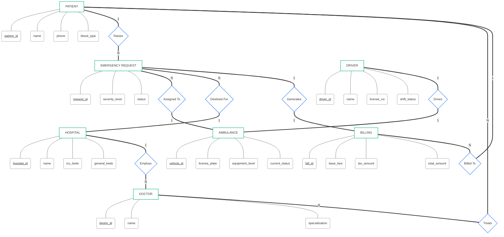

```mermaid
flowchart TB
    %% --- ENTITIES (Rectangles) ---
    Patient["PATIENT"]
    Request["EMERGENCY REQUEST"]
    Ambulance["AMBULANCE"]
    Driver["DRIVER"]
    Hospital["HOSPITAL"]
    Doctor["DOCTOR"]
    Bill["BILLING"]

    %% --- RELATIONSHIPS (Diamonds) ---
    Raises{"Raises"}
    AssignedTo{"Assigned To"}
    Drives{"Drives"}
    DestinedFor{"Destined For"}
    Generates{"Generates"}
    BilledTo{"Billed To"}
    Employs{"Employs"}
    Treats{"Treats"}

    %% --- ATTRIBUTES (Ovals/Circles) ---
    
    %% Patient Attributes
    P_Id("<u>patient_id</u>")
    P_Name("name")
    P_Phone("phone")
    P_Blood("blood_type")
    
    %% Request Attributes
    R_Id("<u>request_id</u>")
    R_Severity("severity_level")
    R_Status("status")
    
    %% Ambulance Attributes
    A_Id("<u>vehicle_id</u>")
    A_Plate("license_plate")
    A_Equip("equipment_level")
    A_Status("current_status")
    
    %% Driver Attributes
    Dr_Id("<u>driver_id</u>")
    Dr_Name("name")
    Dr_License("license_no")
    Dr_Status("shift_status")
    
    %% Hospital Attributes
    H_Id("<u>hospital_id</u>")
    H_Name("name")
    H_ICU("icu_beds")
    H_Gen("general_beds")
    
    %% Doctor Attributes
    Doc_Id("<u>doctor_id</u>")
    Doc_Name("name")
    Doc_Spec("specialization")
    
    %% Bill Attributes
    B_Id("<u>bill_id</u>")
    B_Fare("base_fare")
    B_Tax("tax_amount")
    B_Total("total_amount")

    %% --- CONNECTIONS: ENTITY TO ATTRIBUTE ---
    Patient --- P_Id
    Patient --- P_Name
    Patient --- P_Phone
    Patient --- P_Blood

    Request --- R_Id
    Request --- R_Severity
    Request --- R_Status

    Ambulance --- A_Id
    Ambulance --- A_Plate
    Ambulance --- A_Equip
    Ambulance --- A_Status

    Driver --- Dr_Id
    Driver --- Dr_Name
    Driver --- Dr_License
    Driver --- Dr_Status

    Hospital --- H_Id
    Hospital --- H_Name
    Hospital --- H_ICU
    Hospital --- H_Gen

    Doctor --- Doc_Id
    Doctor --- Doc_Name
    Doctor --- Doc_Spec

    Bill --- B_Id
    Bill --- B_Fare
    Bill --- B_Tax
    Bill --- B_Total

    %% --- CONNECTIONS: ENTITY TO RELATIONSHIP (Cardinality) ---
    Patient ===| 1 | Raises
    Raises ===| N | Request

    Request ===| N | AssignedTo
    AssignedTo ===| 1 | Ambulance

    Driver ===| 1 | Drives
    Drives ===| 1 | Ambulance

    Request ===| N | DestinedFor
    DestinedFor ===| 1 | Hospital

    Request ===| 1 | Generates
    Generates ===| 1 | Bill

    Bill ===| N | BilledTo
    BilledTo ===| 1 | Patient

    Hospital ===| 1 | Employs
    Employs ===| N | Doctor

    Doctor ===| N | Treats
    Treats ===| N | Patient

    %% --- STYLING (To Match Academic Standards) ---
    classDef entity fill:#ffffff,stroke:#10b981,stroke-width:2px;
    classDef relationship fill:#ffffff,stroke:#3b82f6,stroke-width:2px;
    classDef attribute fill:#ffffff,stroke:#6b7280,stroke-width:1px;

    class Patient,Request,Ambulance,Driver,Hospital,Doctor,Bill entity;
    class Raises,AssignedTo,Drives,DestinedFor,Generates,BilledTo,Employs,Treats relationship;
    class P_Id,P_Name,P_Phone,P_Blood,R_Id,R_Severity,R_Status,A_Id,A_Plate,A_Equip,A_Status,Dr_Id,Dr_Name,Dr_License,Dr_Status,H_Id,H_Name,H_ICU,H_Gen,Doc_Id,Doc_Name,Doc_Spec,B_Id,B_Fare,B_Tax,B_Total attribute;
```
